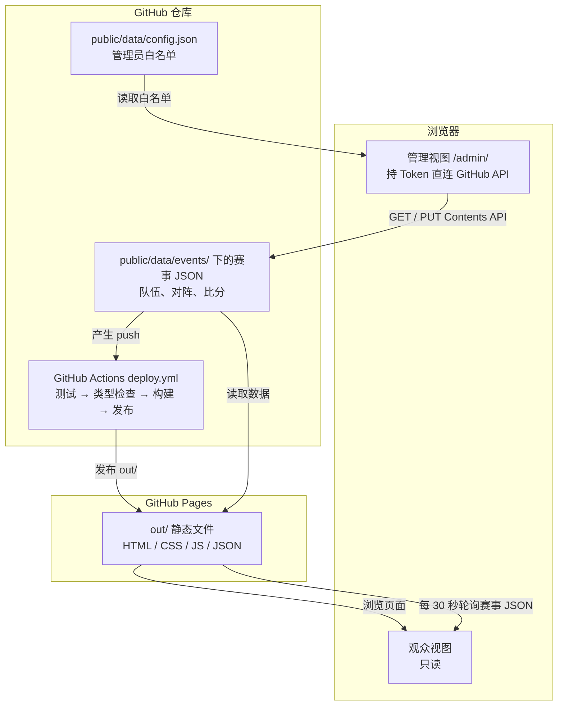
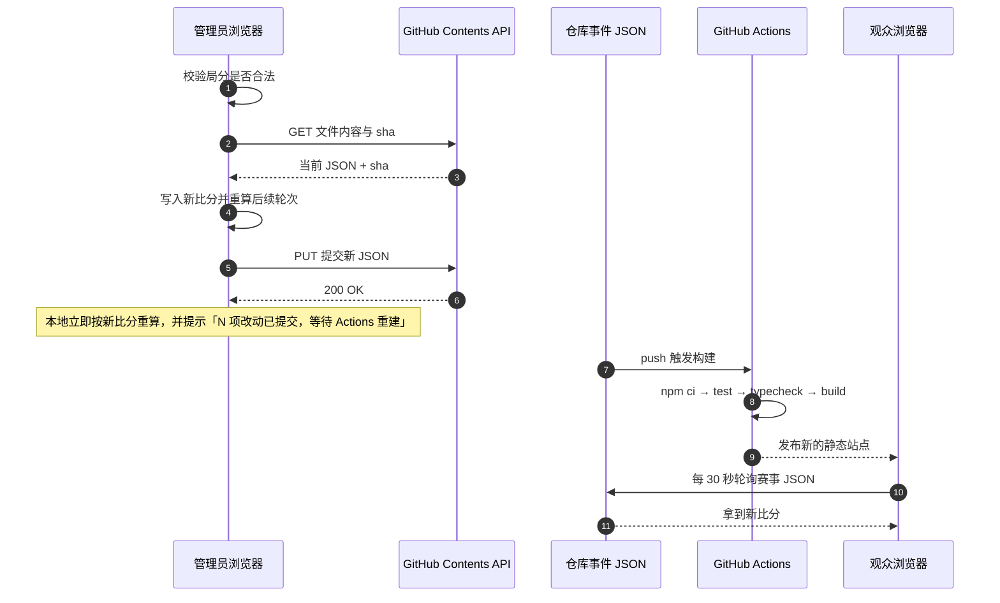
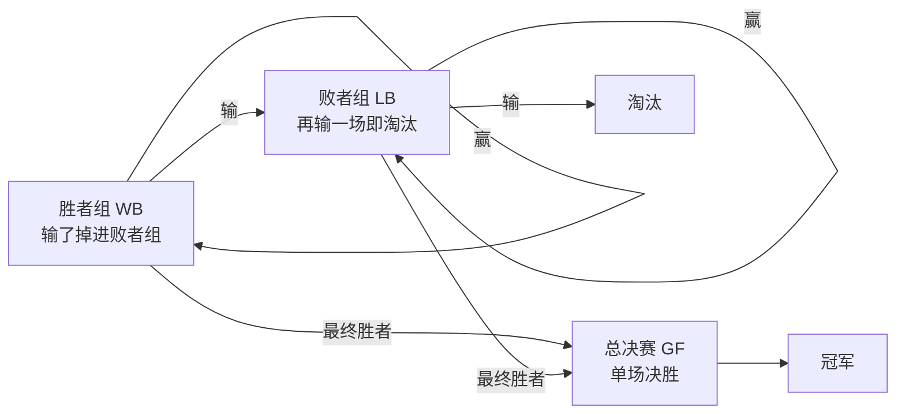
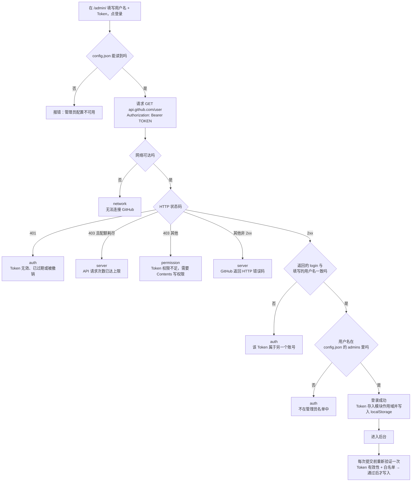

# 比赛赛程网站

双败淘汰制赛事的**对阵图、比分与晋级路径**展示站点，附带一套**免注册的 GitHub 后台**：观众打开网页就能看，管理员在网页上直接录分，改动自动提交回仓库并触发重建。

部署在 GitHub Pages，**没有服务器、没有数据库**。

[](https://github.com/Structuretxwd/Match-Schedule/actions/workflows/deploy.yml)

**线上地址：** https://structuretxwd.github.io/Match-Schedule/

---

## 目录

- [这个站点能做什么](#这个站点能做什么)
- [它是怎么工作的](#它是怎么工作的)
- [观众怎么用](#观众怎么用)
- [管理员怎么用](#管理员怎么用)
- [管理员登录与 Token 验证流程](#管理员登录与-token-验证流程)
- [从零部署](#从零部署)
- [添加 / 移除管理员](#添加--移除管理员)
- [赛事数据文件格式](#赛事数据文件格式)
- [本地开发](#本地开发)
- [故障排查](#故障排查)
- [安全边界](#安全边界)
- [技术栈与目录结构](#技术栈与目录结构)
- [许可](#许可)

---

## 这个站点能做什么

### 观众看到什么

| 页面 | 地址 | 内容 |
|---|---|---|
| 赛事列表 | `/` | 所有赛事、状态、签表规模、已结束 / 总场次 |
| 对阵图 | `/event/<赛事ID>/` | 胜者组、败者组、总决赛三块图，含晋级连接线 |
| 赛程表 | `/event/<赛事ID>/schedule/` | 按日期分组的比赛列表、时间、比分、进行中标记 |
| 队伍 | `/event/<赛事ID>/teams/` | 各队名称、种子位与选手名单 |
| 比赛详情 | 点任意对阵卡片弹出 | 时间、BO 局数、比分、直播链接、备注、裁判 |

- 无需登录、无需注册，打开就能看。
- 页面**每 30 秒自动刷新**一次，比分更新后观众端会自动跟上，不用手动刷。
- 移动端可用，无横向滚动。

### 管理员能做什么

全部集中在 `/admin/`：

| 操作 | 说明 |
|---|---|
| 创建赛事 | 填赛事 ID、名称、签表规模（4 / 8 / 16 / 32）、队伍名单，系统按种子位自动生成首轮对阵 |
| 录入 / 修改比分 | 点对阵卡片 → 填局分 → 提交，**后续轮次会自动重算** |
| 清除比分 | 撤销已录入的结果 |
| 标记「进行中」 | 让观众端显示实时标记，可取消 |
| 改队名 / 选手名单 | 赛事列表 → 「编辑队伍与公告」 |
| 发布 / 删除公告 | 同上，公告区 |
| 删除赛事 | 赛事列表 → 「删除」→ 输入赛事 ID 确认 |

关于比分录入的规则：

- 只支持 **BO1 / BO3 / BO5 / BO7**，必须录入完整局分（如 `2:1`）。
- 判定获胜的条件是**胜局数达到 `ceil((BO + 1) / 2)`**。例如 BO3 需要 2 局、BO5 需要 3 局，所以 `3:0` 在 BO3 下会因为超出范围而被拒绝。
- 赛事的 `defaultBO` 作用于所有比赛，`grandFinalBO` 单独作用于总决赛（默认 BO5）。
- **总决赛不采用「重置」规则**，只打一场决定冠军。

---

## 它是怎么工作的

整个站点没有服务端进程。观众读到的是 GitHub Pages 上的静态文件；管理员的写操作由浏览器**直接**调用 GitHub 的 Contents API 落到仓库里的 JSON 文件，写进去的 push 又会触发 Actions 重新构建站点。



这样设计的好处是：**所有数据都在 Git 里**，每一次比分改动都是一条可追溯的 commit，可以随时回滚、可以 fork、也不需要任何数据库费用。

### 一次录分的完整链路



**关键点：写入不是即时全网生效的。** 管理员自己的页面会立刻反映新比分（本地乐观更新），但其他人要等 Actions 重建完成（约 1–2 分钟）。所以录完分看到「N 项改动已提交，等待 Actions 重建」是**正常现象，不是故障**。

如果两个人同时改同一个文件，提交会收到 409 / 422 冲突，程序会自动重新拉取最新内容并把本次改动重新应用一遍，最多重试 3 次。

### 双败赛制是怎么算的



晋级逻辑是一个**纯函数**：输入「种子排位 + 已确认的结果」，输出全部对阵与队伍落位。所以你只要改一场比分，后面所有轮次会自动重算，不会出现前后不一致。

---

## 观众怎么用

**什么都不用做。** 直接打开 https://structuretxwd.github.io/Match-Schedule/ 即可。

- 在首页点赛事名进入对阵图。
- 在对阵图页顶部可切换到「赛程」和「队伍」。
- 点任意一场比赛卡片，弹出详情（含直播链接）。
- 页面每 30 秒自动更新，无需刷新。

---

## 管理员怎么用

### 第一步：创建一个专用 Token

站点不提供注册功能，管理员身份由 **GitHub 用户名 + 一个 fine-grained Token** 共同确认。

1. 打开 GitHub → 右上头像 → **Settings**
2. 左侧最底部 → **Developer settings**
3. **Personal access tokens** → **Fine-grained tokens** → **Generate new token**
4. 填写：
   - **Token name**：随便取，例如 `match-schedule-admin`
   - **Expiration**：建议 90 天（到期后重新生成并重新登录）
   - **Repository access**：选 **Only select repositories** → 只勾 **Match-Schedule**
   - **Repository permissions** → 找到 **Contents** → 设为 **Read and write**
   - **其余所有权限保持 No access**
5. 点 **Generate token**，**立刻复制**（离开页面就再也看不到了）

> 千万不要勾选 **All repositories**，也不要把权限放得比 `Contents: write` 更宽。

### 第二步：登录

1. 打开 https://structuretxwd.github.io/Match-Schedule/admin/
2. **GitHub 用户名**填 `Structuretxwd`（必须与 Token 的归属账号一致）
3. **Fine-grained Token**粘贴刚复制的 Token
4. 点「登录」

登录成功后，页面顶部会显示当前身份和「退出登录」按钮。

### 第三步：日常操作

```
/admin/
├── 创建赛事        → 填 ID、名称、签表规模、队伍名单 → 创建
└── 赛事列表
    ├── 「编辑队伍与公告」 → 改队名/选手、发布公告、删除公告
    └── 「删除」         → 输入赛事 ID 确认 → 确认删除
```

录入比分的路径是：进入赛事对阵图 → 点比赛卡片 → 在弹窗里填两队的局分 → 提交。同一弹窗里还有「清除比分」和「标记「进行中」」。

**常见误区：** `matches`（对阵表）是在创建赛事时由种子位自动生成的，页面上没有直接编辑对阵表的功能。想调整对阵请重新创建赛事，不要手工改 JSON。

---

## 管理员登录与 Token 验证流程

登录时一共过两道关卡，**每次写操作前还会再复验一次**。



### 这套验证**不**检查什么（重要）

这是最容易踩坑的地方：`GET /user` 只要 Token 本身有效就会返回 200，**它不验证这个 Token 有没有仓库写权限**。

| 不验证 | 后果 |
|---|---|
| 仓库写权限 | 一个「只读」Token 能**登录成功**，直到第一次真正提交才以 403 暴露为「权限不足」 |
| 仓库名是否存在 / 是否正确 | `config.json` 里的 `repo` 直到写入那一刻才被使用，仓库名填错也能登录 |
| Token 类型 | 虽然输入框写着 Fine-grained，但 classic PAT（带 `repo` scope）同样能通过并正常写入 |
| 过期时间 | fine-grained Token 的过期时间不在响应里，只能等真的失效后由 401 发现 |

一句话：**验证的是「Token 有效 + 它属于白名单里的这个用户名」，不验证「这个 Token 能不能写这个仓库」。** 后者要等你按下第一次提交才会由 GitHub 告诉你。

### 失败提示对应表

| GitHub 返回 | 界面提示 |
|---|---|
| 401 | Token 无效、已过期或被撤销，请在 GitHub 重新生成 |
| 403（配额耗尽） | GitHub API 请求次数已达上限，请稍后重试 |
| 403（其他） | Token 权限不足：需要本仓库 Contents 的写权限，并附上具体该勾哪些权限 |
| 连不上 | 无法连接 GitHub：具体网络错误 |
| 其他 | GitHub 返回 HTTP 错误码 |

遇到认证类失败会自动退出登录；权限类失败会额外告诉你**具体该去勾哪个权限**。

---

## 从零部署

1. **推送仓库到 GitHub**，分支名 `main`。
2. **确认 `package-lock.json` 已提交**（workflow 用的是 `npm ci`，缺这个文件会直接失败）。
3. **开启 Pages**：仓库 **Settings → Pages → Build and deployment → Source** 选 **GitHub Actions**。
4. **触发构建**：push 到 `main` 会自动触发；也可以在 **Actions** 页选 `Deploy to GitHub Pages` → **Run workflow** 手动触发。
5. 构建完成后访问 `https://<你的用户名>.github.io/<仓库名>/`。

> **这一步的顺序很关键。** `deploy.yml` 里的 `actions/configure-pages` 会在构建时检查 Pages 是否已启用，**没启用就直接失败**（前 8 步全绿，只有这一步红）。所以请务必**先完成第 3 步，再触发构建**。
>
> 如果你已经先跑过一次并失败了：补上第 3 步，然后回到 Actions 页，选那次失败的运行 → **Re-run all jobs**（或点 Run workflow 重新触发一次）即可，代码不用改。

部署在项目子路径下时，`deploy.yml` 会自动把仓库名注入成 `NEXT_PUBLIC_BASE_PATH`：

```yaml
env:
  NEXT_PUBLIC_BASE_PATH: /${{ github.event.repository.name }}
```

无需手工维护。如果你改成**用户站点**或**自定义域名**（部署在根路径），把这一项改成空字符串 `''` 即可，其余代码不用动。

---

## 添加 / 移除管理员

**不需要注册功能。** 管理员名单就是 `public/data/config.json` 里的 `admins` 数组：

```jsonc
{
  "repo": { "owner": "Structuretxwd", "repo": "Match-Schedule", "branch": "main" },
  "admins": [
    { "login": "Structuretxwd", "role": "admin" },
    { "login": "someone-else",  "role": "referee" }
  ],
  "requiredTokenScopes": { "contents": "write", "path": "public/data/" }
}
```

- `login` 必须与对方 GitHub 用户名的**实际写法**一致（比较时不区分大小写）。
- `role` 取 `admin`（全部权限）或 `referee`（录分）。
- **移除管理员**＝从这个数组里删掉那一行。对方下次操作时会被自动复验拦下并退出登录。

改完提交、等 Actions 重建完成后，该用户就能在 `/admin/` 登录了。

`repo` 三个字段必须与仓库真实位置一致，页面的写入功能要靠它拼 GitHub API 地址。

---

## 赛事数据文件格式

### `public/data/config.json`

```jsonc
{
  "repo": { "owner": "账号名", "repo": "仓库名", "branch": "main" },
  "admins": [ { "login": "GitHub 用户名", "role": "admin" } ],
  "requiredTokenScopes": { "contents": "write", "path": "public/data/" }
}
```

### `public/data/events/<赛事ID>.json`

```jsonc
{
  "id": "spring-2026",                          // 必须与文件名一致
  "name": "2026 春季赛",
  "format": "double-elimination",               // 目前仅支持这一种
  "bracketSize": 8,                             // 4 | 8 | 16 | 32
  "status": "ongoing",                          // draft | ongoing | finished
  "defaultBO": 3,                               // 1 | 3 | 5 | 7
  "grandFinalBO": 5,                            // 总决赛单独使用
  "teams": [
    {
      "id": "t1",
      "name": "赤霄",
      "seed": 1,                                // 种子位，决定首轮对阵
      "players": [ { "name": "选手A" } ],
      "logo": null                              // 图片 URL 或 null
    }
  ],
  "matches": [
    {
      "id": "WB-R1-M1",
      "bracket": "WB",                          // WB 胜者组 | LB 败者组 | GF 总决赛
      "round": 1,
      "index": 1,
      "bo": 3,
      "scoreA": 2,                              // null 表示未录入
      "scoreB": 1,
      "live": false,                            // 是否标记为进行中
      "scheduledAt": "2026-10-01T14:00:00+08:00",  // 或 null
      "referee": null,                          // 或裁判名
      "streamUrl": null,                        // 或直播链接
      "note": null                              // 或备注
    }
  ],
  "announcements": [
    { "id": "a1", "content": "公告内容", "createdAt": "2026-09-25T10:00:00.000Z" }
  ],
  "updatedAt": "2026-09-25T10:00:00.000Z"
}
```

**这三类字段不要手工改**，都应由页面生成：

- `matches` —— 创建赛事时按种子位自动生成，手工删改只会让对阵图缺场次或连接线错位。
- `id` / `bracketSize` —— 与生成的对阵表强绑定。
- `updatedAt` —— 每次写入自动更新。

数据文件在构建时被读取并校验。如果字段缺失或类型不对，构建会失败，**Actions 日志里会直接指出是哪个字段出错**（例如 `event.matches[3].scoreA: 应为数字或 null`），按提示改即可。

---

## 本地开发

```bash
npm ci
npm run dev          # http://localhost:3000
npm test             # 单元测试
npm run typecheck    # 类型检查
npm run build        # 静态导出到 out/
```

本地默认部署在根路径（`NEXT_PUBLIC_BASE_PATH` 为空）。要模拟项目站点的子路径部署：

```powershell
# PowerShell
$env:NEXT_PUBLIC_BASE_PATH="/Match-Schedule"; npm run build
```

```bash
# bash / zsh
NEXT_PUBLIC_BASE_PATH=/Match-Schedule npm run build
```

> 本项目使用 **PowerShell 语法**。注意 PowerShell 不支持 `&&` 链式命令，且上述环境变量赋值只在**当前会话**有效。

本地预览导出结果：

```bash
npx serve out
```

---

## 故障排查

| 现象 | 原因与处理 |
|---|---|
| 打开网址显示 **「Site not found · GitHub Pages」** | 站点从未成功发布过。去 Actions 页看 `Deploy to GitHub Pages` 的运行：如果失败在 `configure-pages` 步骤，说明 **Settings → Pages 的 Source 还没选 GitHub Actions**（或选在了失败运行之后）。补上设置后 **Re-run all jobs** 即可 |
| Actions 前几步全绿，只有 `configure-pages` 失败 | 同上：执行那一刻 Pages 尚未启用。设置好 Pages 后重跑 |
| `npm ci` 步骤失败 | `package-lock.json` 没提交，或与 `package.json` 不一致 |
| 页面显示「数据暂不可用」 | `public/data/events/<id>.json` 不存在或结构不合法。看 Actions 日志里报错的具体字段名 |
| 构建报某个字段类型错误 | 数据文件被手改坏了。按日志里给出的字段路径（如 `event.teams[2].seed`）修正 |
| 对阵图缺场次或连接线错位 | `matches` 数组被手工改动过。它由创建赛事时按种子位生成，建议删掉该赛事重新创建 |
| 登录提示「不在管理员名单中」 | 用户名没写进 `config.json`，或写了但 Actions 还没重建完成 |
| 登录提示「Token 无效、已过期或被撤销」 | Token 过期或被删除，在 GitHub 重新生成一个 |
| 登录成功但提交时提示权限不足 | Token 缺 `Contents: write`，按提示里的说明重新勾选权限 |
| 提交成功但别人看不到变化 | Actions 还在构建，等 1–2 分钟；仍无变化则去 Actions 页看构建是否失败 |
| 子路径部署后样式 / 数据 404 | `NEXT_PUBLIC_BASE_PATH` 与真实仓库名不一致（注意大小写）。正常由 workflow 自动注入，检查是不是被手工改过 |
| 提交时提示「数据已被他人同时修改」 | 有人在同时改同一个文件，自动重试 3 次仍失败。刷新页面后重试 |

---

## 安全边界

这一节务必读完。

- **`config.json` 里的 `admins` 白名单是前端校验，不构成安全边界。** 它只能防误操作，不能防恶意行为：任何人都能看到这份名单，也能自己改一份前端代码绕过它。
- **真正的安全边界是 GitHub Token 自身的仓库写权限。** 站点没有服务端，写入由浏览器直接调用 GitHub API，所以每个管理员手里的 Token 就是他的权限范围。
- 因此请遵守两条硬规则：
  1. **永远不要给 Token 超过 `Contents: write` 的权限**，也不要勾选 **All repositories**。
  2. **不要把 Token 写进任何文件、聊天记录或截图。**
- Token 只保存在**管理员本人浏览器的 localStorage**（键名 `ms.auth.v1`），不会提交到仓库，也不会发送给 `api.github.com` 以外的任何服务器。
- Token 只存在于页面的模块作用域内，**不会进入 React 的 context**，业务组件拿不到 Token，只能用「是否管理员」和「提交改动」这几个能力。
- 站点的公开数据（赛程、比分、队名）本来就是要给所有人看的，不是敏感信息；真正需要保护的是仓库的写权限。

---

## 技术栈与目录结构

| 项目 | 选择 |
|---|---|
| 框架 | Next.js 15 App Router，`output: 'export'` 静态导出 |
| UI | React 19 + Tailwind CSS 4 |
| 语言 | TypeScript 5.9，`strict: true` |
| 测试 | Vitest 3（Node 环境，组件用 `react-dom/server` 做静态渲染断言） |
| 运行时依赖 | 只有 `next` / `react` / `react-dom`，**没有数据库、没有 SDK** |
| 部署 | GitHub Pages + GitHub Actions |
| 数据 | 仓库内的 JSON 文件，用 Git 做版本管理 |

```text
app/                            页面（App Router）
  page.tsx                      首页：赛事列表
  admin/page.tsx                后台
  layout.tsx                    全站布局（含认证 Provider）
  globals.css                   Tailwind 主题变量
  event/[id]/
    layout.tsx                  赛事页外壳与标签导航
    page.tsx                    对阵图
    schedule/page.tsx           赛程
    teams/page.tsx              队伍

components/                     UI 组件
  auth/                         认证上下文、登录表单、管理员门禁
  admin/                        后台：赛事列表、创建赛事、队伍与公告编辑
  BracketView.tsx               对阵图
  Connectors.tsx                对阵图连接线
  ScheduleView.tsx              赛程表
  TeamsView.tsx                 队伍页
  MatchCard.tsx                 比赛卡片
  MatchDetailDialog.tsx         比赛详情与录分弹窗
  EventClient.tsx               赛事页客户端逻辑与轮询

lib/
  bracket/                      赛制核心（纯函数）
    generate.ts                 按种子位生成对阵模板
    advance.ts                  由比分推导后续轮次
    layout.ts                   对阵图坐标计算
    validate.ts                 BO 与局分校验
  data/
    schema.ts                   数据校验与解析
    load.ts                     构建时读取数据文件
    github.ts                   GitHub Contents API 读写（唯一写入通道）
  auth/session.ts               登录会话的本地存储
  admin/                        创建赛事、编辑队伍与公告
  useEventData.ts               观众端 30 秒轮询与乐观更新
  view.ts                       展示层格式化工具
  urls.ts                       basePath 处理

public/data/                     站点数据（管理员通过页面写入的就是这里）
  config.json                   管理员白名单与仓库坐标
  events/<id>.json              赛事数据

docs/superpowers/               设计文档与实施计划
.github/workflows/deploy.yml    测试 → 类型检查 → 构建 → 发布
```

---

## 许可

本项目基于 [Apache License 2.0](LICENSE) 开源。
